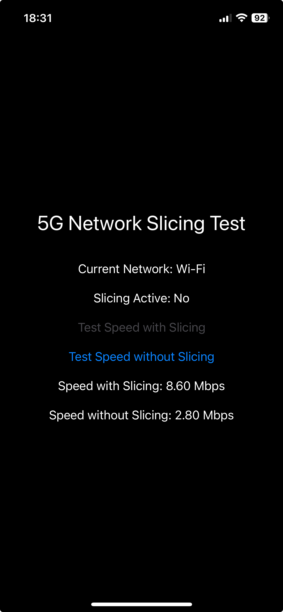

# BandWidht
This repository contains a sample iOS application. The app implements a bandwidht iOS app for checking speeds when device is connected to 5G network or does not. This is the base code used in following post [5G Network Slicing on iOS](https://javios.eu/swift/5g-network-slicing-on-ios/)

## Screenshots

## Requirements

- **Xcode 15.0 or later**
- **iOS 16.0 or later**

